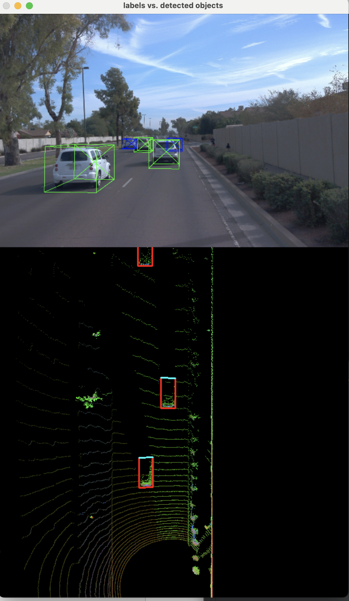
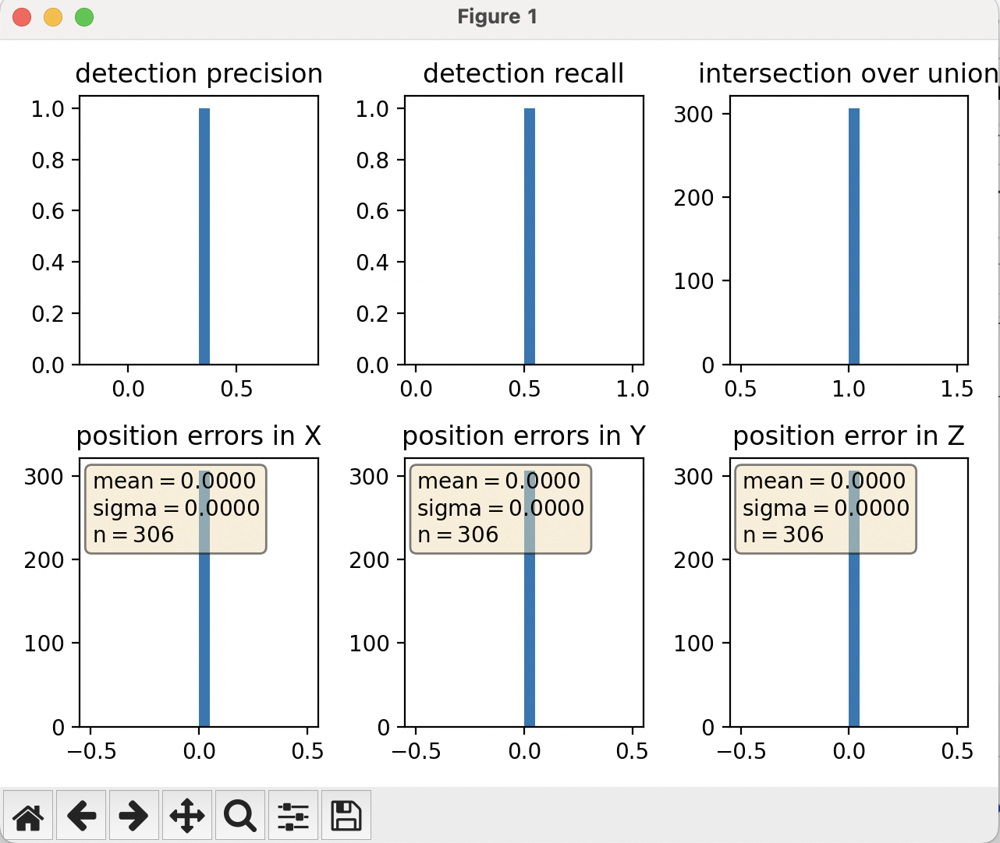

# SDCND : Sensor Fusion and Tracking
This is the project for the second course in the  [Udacity Self-Driving Car Engineer Nanodegree Program](https://www.udacity.com/course/c-plus-plus-nanodegree--nd213) : Sensor Fusion and Tracking. 

In this project, you'll fuse measurements from LiDAR and camera and track vehicles over time. You will be using real-world data from the Waymo Open Dataset, detect objects in 3D point clouds and apply an extended Kalman filter for sensor fusion and tracking.

The project consists of two major parts: 
1. **Object detection**: In this part, a deep-learning approach is used to detect vehicles in LiDAR data based on a birds-eye view perspective of the 3D point-cloud. Also, a series of performance measures is used to evaluate the performance of the detection approach. 
2. **Object tracking** : In this part, an extended Kalman filter is used to track vehicles over time, based on the lidar detections fused with camera detections. Data association and track management are implemented as well.

# Midterm Project: 3D Object Detection
Code implementation can be found here in this repo: https://github.com/mhchen124/SDC_Sensor_fusion

## Section 1: Computer Lidar Point-Cloud from Range Image
### Visualize range image channels (ID_S1_EX1)
The required steps specified in ID_S1_EX1 has been coded in *show_range_image* inside *object_pcl.py*. 
The lidar data and range image have been extracted for the roof-mounted lidar
, then the range and the intensity channel were retrieved from the range image
(negative values have been set to 0), followed by mapping the range channel onto an 8-bit scale
and make sure that the full range of values is appropriately considered, mapping the intensity
channel onto an 8-bit scale and normalize with the difference between the 1- and 99-percentile
to mitigate the influence of outliers, and finally stacking up the range and intensity image 
vertically using np.vstack and convert the result to an unsigned 8-bit integer.

The stacked image is shown here:

### Visualize point-cloud (ID_S1_EX2)
Ten point-cloud images have been selected for examination, and they are displayed below:

| frame0       | frame20     |
|----------------------------------------|---------------------------------------|
| frame 40    | frame60    |
| frame80     | frame100  |
| frame120   | frame140  |
| frame 160  | frame180  |

#### General Observations On Point-Cloud Images
From the above 10 pcl sample images, a few observations have been reached:

- Overall speaking the current state of point-cloud image still have a very low resolution due to the hardware
limitations. The objects (vehicles) in the image are still very rough in shape, blured on edges/boundaries,
and kind hard to tell exact shape of each vehicle
- Since it is a light-based technology, blockage by object is obvious - the object in front block an entire
fan-shaped erea behind it
- The backend of a vehicle appeared more clear in the images due to high intensity of the reflected laser beams?

## Section 2 : Create Birds-Eye View from Lidar PCL
### Convert sensor coordinates to BEV-map coordinates (ID_S2_EX1)
To create a BEV image from PCL, one needs to properly compute the digitization units along a specific axis.
This includes dividing x-range/y-range by bev_image height/width, and transfer all PCL x,y coordinates into
bev image coordinates. The computed bev image for frame0 is shown below.

BEV image for frame0 

### Compute intensity layer of the BEV map (ID_S2_EX2)
The intensity layer was obtained by picking the max intensity value for a group of PCL points having same x and y values,
and then normalize its value for proper visible range.
The intensity layer for frame0 in our EX2 is shown below.

Intensity image for frame0  

### Compute height layer of the BEV map (ID_S2_EX3)
The height layer was obtained by picking the max z value (the top-most one) for a group of PCL points having same x and y values,
and then normalize its value for proper visible range.
The intensity layer for frame0 in our EX3 is shown below.

Height image for frame0 

## Section 3 : Model-based Object Detection in BEV Image
### Add a second model from a GitHub repo (ID_S3_EX1)
In this section, a fpn_resnet model is used to detect objects in BEV image. A pre-trained ResNet18 model
(in pkl format) was loaded in and object detection was carried out on BEV image. The detected object results
are shown here:
---
`processing frame #50
computing point-cloud from lidar range image
computing birds-eye view from lidar pointcloud
student task ID_S2_EX1
lidar_pcl dim = (63745, 4)
X len per pixel = 0.08223684210526316
lidar_pcl_copy dim = (63745, 4)
student task ID_S1_EX2
student task ID_S2_EX2
student task ID_S2_EX3
using groundtruth labels as objects
loading object labels and validation from result file
valid_label_flaps = [False False False False False  True False  True False False False False
  True False False False False]
loading detection performance measures from file:`

`det_performance = [[0.7740521801518745, 0.7862481398783719], [[-0.14378044937141965, 0.14701028073307398, -0.15474473668787136], [-0.16351952295563876, 0.10525398632566052, -0.3640736637529016]], [3, 2, 1, 0]]`

show_objects_in_bev_labels_in_camera ### 

`project_detections_into_bev: detections =  [[1, 49.575214383670755, 4.0394287166964205, 1.0292643213596193, 1.7700000000000102, 2.0181655979315245, 4.513134775681905, -0.0006114911448493743], [1, 17.84296889851612, 3.912246984706144, 0.8291298942401681, 1.6899999999999977, 1.9384529721750436, 4.27370457474128, 0.007390584235945408], [1, 29.173896674168645, 0.7435155805960676, 0.8929607095304846, 1.9099999999999966, 2.0354414125040745, 4.307956063242486, -0.010818934012628567]]`

`a row = [1, 49.575214383670755, 4.0394287166964205, 1.0292643213596193, 1.7700000000000102, 2.0181655979315245, 4.513134775681905, -0.0006114911448493743]
_id = 1, _x = 49.575214383670755, _y = 4.0394287166964205, _z = 1.0292643213596193, _h = 1.7700000000000102, _w = 2.0181655979315245, _l = 4.513134775681905, _yaw = -0.0006114911448493743`

`a row = [1, 17.84296889851612, 3.912246984706144, 0.8291298942401681, 1.6899999999999977, 1.9384529721750436, 4.27370457474128, 0.007390584235945408]
_id = 1, _x = 17.84296889851612, _y = 3.912246984706144, _z = 0.8291298942401681, _h = 1.6899999999999977, _w = 1.9384529721750436, _l = 4.27370457474128, _yaw = 0.007390584235945408`

`a row = [1, 29.173896674168645, 0.7435155805960676, 0.8929607095304846, 1.9099999999999966, 2.0354414125040745, 4.307956063242486, -0.010818934012628567]
_id = 1, _x = 29.173896674168645, _y = 0.7435155805960676, _z = 0.8929607095304846, _h = 1.9099999999999966, _w = 2.0354414125040745, _l = 4.307956063242486, _yaw = -0.010818934012628567`

### Extract 3D bounding boxes from model response (ID_S3_EX2)
In this exercise the BEV image coordinates (in pixel) are transformed into vehicle coordinates (in m).
The resulting detected object are marked (in red) on BEV image and 3d bounding boxes are imposed on the
original image as shown below.

3D object detection result 

## Section 4 : Performance Evaluation for Object Detection
### Compute intersection-over-union between labels and detections (ID_S4_EX1)
This exercise was carried out by looping through all detected objects, compare each object (using 4-corner
information) with the ground-truth object. If there is an overlap, then intersection and union of the two
and iou value was computed. If the value over the min iou threshold then a match is found.

The resulting data in our test case are shown here:
 
IOU
 
`[0.7740521801518745, 0.7862481398783719]`
 
center_devs
 
`[-0.14378044937141965, 0.14701028073307398, -0.15474473668787136]`
 
`[-0.16351952295563876, 0.10525398632566052, -0.3640736637529016]]`

### Compute precision and recall (ID_S4_EX3)
The resulting plots for running over 100 frames is:
Detection performance validation on 100-frame run 
 
The resulting plots for running over 100 frames loading labels as objects is:
Detection performance validation on 100-frame run 

## External Dependencies
Parts of this project are based on the following repositories: 
- [Simple Waymo Open Dataset Reader](https://github.com/gdlg/simple-waymo-open-dataset-reader)
- [Super Fast and Accurate 3D Object Detection based on 3D LiDAR Point Clouds](https://github.com/maudzung/SFA3D)
- [Complex-YOLO: Real-time 3D Object Detection on Point Clouds](https://github.com/maudzung/Complex-YOLOv4-Pytorch)

## License
[License](LICENSE.md)
